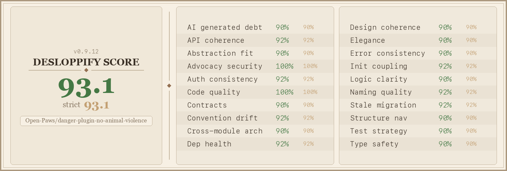

<!--
tech_stack: TypeScript, Danger.js, Node.js
project_status: active
difficulty: beginner-friendly
skill_tags: danger, code-review, inclusive-language, speciesism, PR-automation
related_repos: no-animal-violence, semgrep-rules-no-animal-violence, eslint-plugin-no-animal-violence, vale-no-animal-violence, vscode-no-animal-violence, no-animal-violence-pre-commit, no-animal-violence-action, reviewdog-no-animal-violence
-->

# danger-plugin-no-animal-violence

[](https://www.npmjs.com/package/danger-plugin-no-animal-violence)
[](./LICENSE)
[](https://www.typescriptlang.org/)
[](https://danger.systems/js/)
[](https://openpaws.ai)
[](scorecard.png)

A [Danger.js](https://danger.systems/js/) plugin that scans PR diffs for speciesist language and suggests inclusive alternatives. It checks only added lines, so existing code is never flagged. Pattern dictionary covers 65+ phrases across idioms, tech-specific terms, and industry euphemisms for animal exploitation, auto-generated from the canonical [no-animal-violence](https://github.com/Open-Paws/no-animal-violence) rule set.

> [!NOTE]
> This project is part of the [Open Paws](https://openpaws.ai) ecosystem — AI infrastructure for the animal liberation movement. [Explore the full platform →](https://github.com/Open-Paws)

---

## Quickstart

**1. Install the plugin**

```bash
npm install --save-dev danger-plugin-no-animal-violence
# or
yarn add --dev danger-plugin-no-animal-violence
```

Peer dependency: `danger >= 10.0.0`

**2. Add to your Dangerfile**

```typescript
// dangerfile.ts
import noAnimalViolence from "danger-plugin-no-animal-violence";

noAnimalViolence();
```

**3. Optional: configure severity**

```typescript
noAnimalViolence({
  severity: "message", // default: "warn"
});
```

**4. Run Danger in CI**

Add a CI step that runs `npx danger ci`. Danger posts PR comments automatically when speciesist phrases appear in added lines.

**5. Verify**

Open a test PR with a phrase like `wild goose chase` in a new line. Danger posts a warning with the phrase, suggested alternatives, and a link to the research.

---

## Example output

When a match is found on an added line, Danger posts a comment in the PR:

```
dangerfile.ts — Danger.js PR comment example
─────────────────────────────────────────────────────────────────────────────
⚠  src/utils/retry.ts: Found "wild goose chase". Consider: "futile search"
   or "pointless pursuit" or "fool's errand".
   [Why?](https://doi.org/10.1007/s43681-023-00380-w)
```

The comment includes: the file where the phrase appears, the exact phrase matched, two or three concrete alternatives, and a link to the research on speciesist language.

---

## Features

**What it flags**

65+ patterns across four categories:

- **Idioms that reference animal harm** — `kill two birds with one stone`, `beat a dead horse`, `like lambs to the slaughter`, `curiosity killed the cat`, and more
- **Industry euphemisms for animal exploitation** — `livestock`, `poultry`, `processing plant`, `humane slaughter`, `depopulation`, `gestation crate`, `spent hen`, `broiler`
- **Tech-specific idioms** — `cattle vs. pets`, `dogfooding`, `canary deployment`, `monkey patch`, `code monkey`, `master/slave`, `whitelist/blacklist`, `herding cats`, `dead cat bounce`
- **General idioms** — `sacred cow`, `guinea pig`, `scapegoat`, `red herring`, `put out to pasture`, `rat race`, `open season`

**Severity levels**

| Value | Danger function | PR effect |
|---|---|---|
| `"warn"` (default) | `warn()` | Yellow warning — non-blocking |
| `"message"` | `message()` | Blue info message — non-blocking |

Both are informational. Neither blocks merging by default; you can promote to `fail()` via a custom Dangerfile wrapper if needed.

**Configuration options**

| Option | Type | Default | Description |
|---|---|---|---|
| `severity` | `"warn" \| "message"` | `"warn"` | Controls which Danger reporter is used |

**Scope**

The plugin scans only `+` lines (added content) across modified and created files. Removed lines and unchanged context lines are never evaluated. This keeps feedback focused on new code and avoids overwhelming teams with historical issues.

---

## Documentation

- [Danger.js documentation](https://danger.systems/js/)
- [Canonical no-animal-violence rules](https://github.com/Open-Paws/no-animal-violence) — the source of truth for all patterns
- [no-animal-violence-action](https://github.com/Open-Paws/no-animal-violence-action) — GitHub Action alternative for teams not using Danger.js
- [Research: Speciesist language and nonhuman animal ethics](https://doi.org/10.1007/s43681-023-00380-w)

**Full no-animal-violence tooling suite**

| Tool | Best for |
|---|---|
| [no-animal-violence-action](https://github.com/Open-Paws/no-animal-violence-action) | Teams without Danger.js — lowest barrier |
| [reviewdog-no-animal-violence](https://github.com/Open-Paws/reviewdog-no-animal-violence) | reviewdog-based PR annotation |
| [eslint-plugin-no-animal-violence](https://github.com/Open-Paws/eslint-plugin-no-animal-violence) | JavaScript/TypeScript linting in editor and CI |
| [semgrep-rules-no-animal-violence](https://github.com/Open-Paws/semgrep-rules-no-animal-violence) | Multi-language static analysis |
| [vscode-no-animal-violence](https://github.com/Open-Paws/vscode-no-animal-violence) | In-editor highlighting |
| [vale-no-animal-violence](https://github.com/Open-Paws/vale-no-animal-violence) | Prose and documentation linting |
| [no-animal-violence-pre-commit](https://github.com/Open-Paws/no-animal-violence-pre-commit) | Pre-commit hook |
| **danger-plugin-no-animal-violence** | Teams already using Danger.js for PR automation |

---

<details>
<summary>Architecture</summary>

**How it works**

```
PR opened / updated
       │
       ▼
Danger reads git diff
       │
       ▼
Plugin iterates modified + created files
       │
       ▼
For each file: fetch diff via danger.git.diffForFile()
       │
       ▼
Scan only the `added` lines (new content only)
       │
       ▼
Test each of 65+ regex patterns against added text
       │
       ▼
Match found → call warn() or message() with file,
              phrase, alternatives, and research link
```

**Pattern source**

`src/index.ts` is auto-generated from [project-compassionate-code](https://github.com/Open-Paws/project-compassionate-code). The canonical rule set lives in [no-animal-violence](https://github.com/Open-Paws/no-animal-violence). Do not edit the pattern array directly — all pattern additions and changes go through the generation pipeline to maintain consistency across the full tooling suite.

**Project structure**

```
src/
  index.ts          # auto-generated plugin entry point (TypeScript)
dist/
  index.js          # compiled output (committed)
  index.d.ts        # type declarations
tests/
  index.test.js     # Node.js built-in test runner
```

**Tech stack:** TypeScript 5, Danger.js ≥ 10, Node.js built-in test runner

</details>

---

## Code Quality



_Scorecard is a point-in-time snapshot (captured 2026-04-18). The live quality gate runs on every PR via the [Desloppify Quality Gate workflow](.github/workflows/desloppify.yml); the badge above will drift until regenerated. To refresh locally: `desloppify scan --path .` and replace `scorecard.png`._

## Contributing

PRs are welcome for plugin behaviour: severity options, output format, diff scanning logic, test coverage. Pattern changes go through the canonical [no-animal-violence](https://github.com/Open-Paws/no-animal-violence) repo — do not edit the pattern array in `src/index.ts` directly.

**Development workflow**

```bash
npm install
npm run build        # compile TypeScript → dist/
npx tsc --noEmit     # type-check without emitting
npm test             # run tests via Node.js built-in runner
```

First time contributing to Open Paws? Check the issues list for `good first issue` labels, or open an issue describing what you want to work on before starting.

---

## Impact / Adoption

<!-- TODO: add download counts or adoption numbers when available -->

This plugin is part of the Open Paws no-animal-violence tooling suite, which is used across the Open Paws platform and contributed to the [project-compassionate-code](https://github.com/Open-Paws/project-compassionate-code) initiative — submitting animal-friendly PRs to open-source repositories at scale.

---

## License

MIT — [Open Paws](https://openpaws.ai)

Open Paws is a 501(c)(3) nonprofit building AI infrastructure for the animal liberation movement.

**Acknowledgments**

Pattern dictionary generated from [project-compassionate-code](https://github.com/Open-Paws/project-compassionate-code). Research foundation: [Speciesist language and nonhuman animal ethics](https://doi.org/10.1007/s43681-023-00380-w), AI & Society (2023).

---

[Donate](https://openpaws.ai/donate) · [Discord](https://discord.gg/openpaws) · [openpaws.ai](https://openpaws.ai) · [Volunteer](https://openpaws.ai/volunteer)
